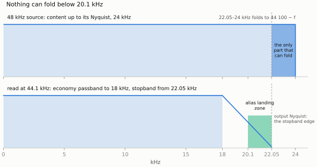

# The degenerate case: 44.1 ↔ 48 as a type

> Simplicity is prerequisite for reliability.
>
> — Edsger W. Dijkstra, "How do we tell truths that might hurt?" (EWD 498, 1975)

Part 0 stated the rule that picks an engine from the clock topology and
Part V stated it again from the deployment side; this is the engine on the
synchronous side of it.

The design brief that became this engine called it *the degenerate case of
the ASRC*: a rational ratio that is known in advance and never drifts. The
brief's argument was that the cleanest way to explain an asynchronous
converter is to show the exact rational machine first, and then say:
*async is what you build when the ratio won't hold still.* This book
arrived at the engines in the other order, because the ASRC was written
first and the family grew around it. So read this part as the brief
intended, in reverse: everything Part I built to track a moving ratio — the
64-bit phase accumulator, the blended coefficient rows, the extra wrap row,
the servo, the ring — is about to be taken away, and what is left is the
fastest converter in the family.

What is left is also the most narrowly scoped. `bridge` converts between
44.1 kHz and 48 kHz, synchronously, in two directions, and does nothing
else. The whole optimization budget is spent on that one ratio pair, and
the charter says so in the shape of its types.

## Two directions, two filters

44.1 → 48 kHz is interpolation by L = 160 and decimation by M = 147;
48 → 44.1 kHz is L = 147, M = 160. Both run a polyphase FIR at the
oversampled rate L·f_in with the cutoff at the lower rate's Nyquist, and
the obvious economy — design one prototype and run it transposed for the
other direction — is wrong, because the two directions are not the same
filter:

| Direction | L / M | Transition band | Relative cost |
|---|---|---|---|
| 44.1 → 48 | 160 / 147 | 20 → 24 kHz | about half |
| 48 → 44.1 | 147 / 160 | 20 → 22.05 kHz | dominant |

Going down, the stopband edge is forced to 22.05 kHz by aliasing: anything
above the *output* Nyquist folds back into the band. Going up, images of
the 44.1 kHz source land above 24 kHz and the stopband edge may sit there.
The down direction's transition is half as wide, so its filter is roughly
twice as long. One prototype run both ways would pay the down direction's
length in the up direction for nothing; `Design.DirectionsAreAsymmetric`
pins that the two shipped designs differ. (The `rational` engine of the
next part has the opposite situation — a Nyquist filter *is* its own
transpose — and gets one pin per band. That is a property of the L-th-band
structure, not a general fact about resamplers.)

So the direction is a compile-time parameter, and the traits that hang off
it carry everything the rest of the engine needs as constants:

```cpp
{{#include ../../../bridge/include/tap/sr/bridge/design.h:rt_direction}}
```

The second template parameter, `K`, is the one piece of generality the
charter admits, and it admits it because it costs nothing. The pair at 2×
and 4× — 88.2 ↔ 96, 176.4 ↔ 192 — is the same ratio, the same L and M, the
same schedule, and, because every hertz in the design is the base pair's
times 2^K and scaling by a power of two is exact in IEEE double, *the same
coefficient table bit for bit*. `Design.RateScaleIsBitIdentical` holds the
tables equal; `Converter.RateScaledConvertersAreTheBaseMachine` holds the
outputs equal. K is a statement about what the frames mean, kept in the
type per the family rule that the caller declares the topology. Nothing is
inferred from a rate, and `K ≤ 2` is a `static_assert`, not a policy.

## The spec is protecting ultrasound

The engine's biggest optimization lever was pulled before any code was
written, and it is an argument rather than a mechanism. Going 48 → 44.1, a
48 kHz source holds nothing above 24 kHz, and aliasing maps a frequency f
to 44,100 − f. So the *entire possible* alias landing zone is
20.1–22.05 kHz: nothing can fold below 20.1 kHz, arithmetically. Going up,
images of baseband content land at 44,100 − f, which is at or above
22.05 kHz. A 120 dB stopband in this converter buys ultrasonic
cleanliness, not audible transparency. At 70 dB every alias product sits
above 20 kHz at ≤ −70 dBFS, and the filter is a quarter the length.



*Going down, the only frequencies that can alias into the passband are
those above the output Nyquist, and a 48 kHz source has none above 24 kHz:
the whole landing zone is the 2 kHz between 20.1 and 22.05 kHz, drawn to
scale from `ratio_traits`' numbers by `scripts/book_figures.py`. The
figure is the argument.*

That is where the profile ladder comes from. Four tiers behind one design
path, named in the family's vocabulary (the ASRC's presets are
`economy` / `balanced` / `transparent` too), each a (stopband, passband
edge) pair with its tap counts pinned:

```cpp
{{#include ../../../bridge/include/tap/sr/bridge/design.h:rt_profile}}
```

The default is `economy`, 70 dB with the passband flat to 18 kHz: 58 taps
per phase going down and 38 going up, which is the MAC count per output
sample, because each output is one row dot. `transparent`, 120 dB to
20 kHz, is 184 / 96. The counts are the minimal *even* numbers whose Kaiser
designs meet the stopband with at least 1 dB of margin on a 12.5 Hz sweep
grid — and one of them is worth a sentence, because it looks like a typo
and is not: in the up direction at the 18 kHz edge, **40 taps fails the
margin and 38 passes**. Kaiser sidelobe peaking is non-monotonic near the
threshold; 38 is a genuine sweet spot, found by the sweep, and the plan
records it so nobody "fixes" it to 40.

`economy` at 18 kHz is itself a re-pin. The engine shipped with its
default at 19 kHz (78 / 44 taps); the ladder was re-measured through every
leg of the test suite — scipy vectors regenerated, the cross-validation
floors re-pinned, the Q15 numbers re-taken — and the 18 kHz design took
the default at 26 % / 14 % fewer MACs, with the former default continuing
unchanged as `balanced`. The trade is stated as a number: the 18–19 kHz
shelf moves into the transition band, measured −1.4 dB at 19 kHz going
down and −0.5 dB going up. Content that must keep that shelf flat pairs
with `balanced`. `super_economy`, 16 kHz at 40 / 28, is a different kind
of promise — an *audible* top-octave shelf, −5.9 dB at 19 kHz going down,
for voice and comms — and so is never a default and is chosen only by
name.

## The design, and a normalization that kills a spur

```cpp
{{#include ../../../bridge/include/tap/sr/bridge/design.h:rt_design}}
```

The designer is DspTap's Kaiser-windowed sinc, the same one Part I's filter
chapter read, called with the direction's phase count and a cutoff midway
between the passband edge and the direction's stopband edge. It runs at
construction time, in double, off the audio path — the family's
runtime-design philosophy, which the original brief had as "precomputed at
build time" and the plan revised: committed tables are a later, measured
lever, and one that is still un-pulled.

The loop after the designer is the part this engine added, and its reason
is specific to a *fixed* schedule. The raw windowed sinc leaves the L
polyphase branches with DC sums spread by the stopband leakage — about
5 × 10⁻⁶ at the 70 dB tier. In the ASRC, which blends between adjacent
rows at a position that drifts, that spread is invisible. Here the
schedule visits the branches with period exactly L, so a per-branch gain
spread turns DC and low-frequency energy into an L-periodic gain ripple:
spurs at multiples of f_out / L, about 300 Hz apart, at the spread's level.
Normalizing every branch's sum to exactly 1.0 in double kills those spurs
identically, perturbs the response only at the spread's own level (far
beneath every profile's spec, re-verified by the spec sweep), and — the
reason the next part's engine inherits the rule unchanged — lets the
fixed-point row-sum quantization land every row on the format's unity
exactly. It is the same R. Bristow-Johnson condition the epilogue of Part V
tells the story of, arrived at from the other side: there, a notebook
measured the spread; here, the period of the schedule predicted it.

## Why this header looks the way it does

| Decision | Alternative rejected | Reason |
|---|---|---|
| Direction as a compile-time `enum` | runtime direction flag | two filters with two phase counts; every table size and trip count a compile-time fact; a deployment needing both instantiates both |
| Two prototypes | one prototype transposed | the directions' transitions are 4 kHz and 2.05 kHz wide; transposing pays the dominant length in the cheap direction |
| Rate scale K ≤ 2 in the type | a runtime rate, or no 2× / 4× pairs | the table is bit-identical at every K (a power of two is exact in double); K says what the frames mean and infers nothing |
| 70 dB `economy` default | 120 dB everywhere | nothing can fold below 20.1 kHz going down and images land ≥ 22.05 kHz going up; the deeper stopband buys ultrasonic cleanliness at 4× the MACs |
| 18 kHz passband for `economy`, 19 kHz as `balanced` | one 70 dB tier | 26 % / 14 % fewer MACs; the trade is a measured −1.4 dB shelf at 19 kHz, and the design that keeps it flat still ships under its own name |
| Pinned even tap counts from a 12.5 Hz sweep | the harris estimate | the sweep found the 38-not-40 non-monotonicity; an estimate would have shipped 40 |
| Per-branch DC normalization | leave the designer's output | a period-L schedule turns a branch-sum spread into spurs at f_out / L; normalization kills them and gives fixed point exact unity rows |
| Design at construction | committed tables in rodata | the family's runtime-design rule; baking is a measured lever still deferred (and construction's share of the embedded workloads is a finding, two chapters on) |

## Verify it yourself

```sh
# The designs meet their specs with the margin, in both directions, at
# every tier; the directions differ; the rate-scaled pairs are the base
# table bit for bit:
cmake -S . -B build -DCMAKE_BUILD_TYPE=Release && cmake --build build -j
ctest --test-dir build -R 'bridge\.Design\.' --output-on-failure

# The design spike that pinned the counts, and the ladder comparison that
# re-pinned economy at 18 kHz, both committed executed:
jupyter nbconvert --to notebook --execute --inplace bridge/notebooks/design_spike.ipynb
jupyter nbconvert --to notebook --execute --inplace bridge/notebooks/profile_ladder.ipynb

# Break it on purpose: set taps_up_to_48k to 40 in profile::economy().
# Design.UpEconomyMeetsSpec fails — the 40-tap design misses the 1 dB
# margin that the 38-tap one clears.
```
