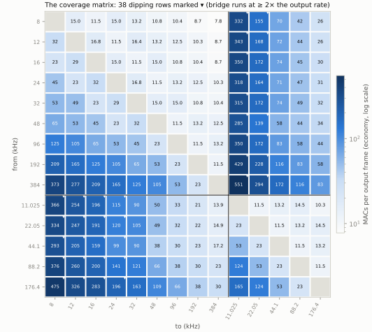

# Chains and the coverage matrix: chain.h

> Fools ignore complexity. Pragmatists suffer it. Some can avoid it. Geniuses remove it.
>
> — Alan Perlis, *Epigrams on Programming*

Fourteen single stages cover fourteen ratios. The family has fourteen
*rates*, which is 182 ordered pairs, and most of them — 8 → 384, 192 → 8,
anything that crosses to 44.1 — need more than one stage. This chapter is
about composing stages into chains, about the rule that decides which
chain each pair gets, and about the test that pins every one of the 182
answers. The composition itself is forty lines in DspTap. The rule is
where the engineering is.

## `chain<>`: the composition point below the engines

The family's dependency rule says each engine depends on `tap::dsp` only
and never names a sibling. A chain that runs a `rational` ↓2 into a
`bridge` 147/160 converter therefore cannot live in either engine: it has
to sit *below* both, in DspTap, and know about neither. The concept it
asks of a stage is structural and deliberately small:

```cpp
{{#include ../../../submodules/dsptap/include/tap/dsp/chain.h:chain_concept}}
```

A sample type, the ratio as two compile-time integers, `process`,
`outputs_for` and `reset` — which `decimate.h`, `bridge`'s converter and
`rational`'s stage all already had. Latency and flush are optional
extensions detected by further concepts: a stage may report
`latency_output_frames()` as an `exact_ratio` or `latency_input_samples()`
as an integer (`decimate.h`'s form), and the chain converts either and
sums them exactly at its output rate. The helper was proven on
`decimate.h` — an existing primitive with its own battery — before any
new engine depended on it, which is the substrate rule's way of making
sure a composition helper is certified by something it was not designed
around.

`process` runs chunks of 64 input frames through scratch buffers sized at
construction from each stage's worst-case output count (⌊nL/M⌋ + 2),
`outputs_for` composes forward, `frames_needed` composes backward — each
stage's is exact and monotone, so a bisection finds the smallest n with
`outputs_for(n) ≥ k` — and flush drains every stage in order:

```cpp
{{#include ../../../submodules/dsptap/include/tap/dsp/chain.h:chain_flush}}
```

Each stage is fed its own `window_frames()` of zeros at its own input and
the result is run through the stages after it, so every stage's tail is
written and the chain's flush equals zero-padding its input, bit for bit.
The `static_assert` names the rule when a stage cannot report its window: a
chain of such stages can still process, and simply cannot flush.

## Which stages, in which order

A factor of 4 could be one 4th-band stage or two half-bands; 6 could be
↓2·↓3 or ↓3·↓2 or a single 6th-band stage; 48 → 32 could be ↑2·↓3 or one
2/3 stage. The plan's rule (R3) is *MACs first, then stage count*, and the
arithmetic behind it is short enough to show. At `economy` (70 dB,
passband 3/8 of the lower rate, so a stage whose lower rate is r has its
transition from 0.375r to 0.625r) the harris estimate gives, for ↓4 from
4r to r:

- **One 4th-band stage.** Transition 0.25r at a rate of 4r: Δω = π/8,
  N ≈ 69 → the Nyquist length 71, 55 nonzero taps. **55 MACs per output.**
- **↓2 then ↓2.** The first stage's lower rate is 2r, so its stopband edge
  may sit at 2r − 0.375r and its transition is 1.25r wide: N = 15, 9
  nonzero, at two outputs per final output = 18. The second stage is the
  tight one: N = 35, 19 nonzero. **37 MACs per output**, −33 %, for 1.5
  output frames more delay.

That is why no 4th-band stage ships (the charter chapter's "no 4"), and
the same arithmetic puts the larger factor at the *high-rate* end of a
chain (↓6 is ↓3·↓2 at 53, not ↓2·↓3 at 64) and makes a mixed ratio a single
stage (2/3 at an estimated 26 against 52 for ↑2·↓3). A generated search
over every monotone factorization through the 2ᵃ·3ᵇ lattice confirms the
rules for all 92 within-family pairs — and then overrides them in one
direction only: *when a chain with strictly fewer stages is within 10 % of
the MAC minimum, the shorter chain wins.* Fewer stages mean less latency,
less state and fewer test rows, and a few per cent is below the estimate's
own error. 3/1 is one ↑3 stage at 12.0 MACs per output, not 3/2·↑2 at
11.0.

Then the pins arrived, and the ledger records what they did to the
arithmetic. On the measured lengths a relaxed half-band *saturates*: below
3/16 of its lower rate the Kaiser fit will not go under m = 7 however wide
the transition, while a third-band stage at the same relaxation is m = 5
and serves three times the rate. So the chains that the estimates ended
in a run of half-bands now put a third-band, 4th-band or mixed stage where
the transition is wide — 8/1 is ↑2·4/3·↑3, 1/8 is ↓3·3/4·↓2, 12/1 is
↑2·↑6 — and 35 of the 182 rows changed chain between the plan's estimate
and its measurement. The rules were not changed; the matrix was
regenerated. A reader who prefers integer-factor chains at a few per cent
can add a tie-break to the generator and regenerate, and the plan says so.

## Each stage at its own rate: the design divisor

A chain declares its profile once: f_pass = p · r_min, with r_min the
chain's lowest rate. A stage higher up the chain has a wider transition
available — the ↓2 from 4r to 2r above is the example — and designing it
at the full profile would waste taps. So `basic_chain` designs each stage
at the profile *relaxed* by the stage's **design divisor**: its lower rate
over r_min, taken down to the largest 2ᵃ·3ᵇ at or below the quotient
(exact within a family, where the quotient is such a number; conservative
across, where a passband at or above f_pass still satisfies the coverage
rule), or the quotient itself when it is below 1 — the one case being a
stage that runs at `bridge`'s rate under a 48-family r_min, 44.1/48 =
147/160, where the passband must *tighten*:

```cpp
{{#include ../../../rational/include/tap/sr/rational/chain.h:rational_design_divisor}}
```

The divisors a chain uses are computed from the ratio pack at compile
time (`k_divisors`), and every divisor the matrix ever produces — 147/160,
1, 2, 3, 4, 6, 8, 9, 12, 16 — has a row in `design.h`'s relaxation tables
with the pinned m per band, found by the same 16,384-point search and
verified against the shipping designer by
`Design.RelaxationTablesAreTheSearchAt70dB`. A divisor without a row, or a
custom profile, is searched at construction. The result is that a chain's
cost is the sum of *measured* stage costs at each stage's actual rate,
which is what the matrix prints.

## The named chains and the matrix

```cpp
{{#include ../../../rational/include/tap/sr/rational/chain.h:rational_named_chains}}
```

Twenty aliases — the 48 kHz family's chains of two or more stages, plus
the two the 44.1 kHz family's lattice chooses differently for 8/1 and 1/8
(its intermediate at r_min·3 = 33.075 kHz is a lattice point where the 48
family's is 12·8/3 = 32 kHz) — named by their stages in order, because
the name *is* the chain and a name that said "times 8" would be a
lookup. A one-stage chain is the converter from the previous chapter.
These names are the C ABI's enumerators, and they are the only things a
foreign caller can construct: `TAP_SR_RATIONAL_DOWN_3_DOWN_8_DOWN_2`, never
`(384000, 8000)`.

The coverage matrix is the plan's section 3: for every one of the 14 × 13
ordered pairs, the chain, its MACs per output at the output rate, and its
latency in output frames, at `economy` and at `transparent`, generated by
`tools/coverage/matrix.py` from the pinned lengths. Within the 48 family
the cheapest conversion is 48/1 at 7.8 MACs per output (↑2·↑8·↑3, 629
frames of latency at 384 kHz) and the dearest 1/48 at 373 (↓3·↓8·↓2).
Across the families every chain contains exactly one `bridge` stage, and
the plan places it at the *lowest* rate scale k whose passband admits
f_pass — `bridge` costs 58 (down) or 38 (up) MACs per output at `economy`
whatever k is, so its cost scales with the rate it runs at, while the ↑2 /
↓2 stages that move a chain between k levels cost 9–19. 48 → 88.2 is
`bridge`↓ at 44.1 kHz then ↑2, 62 % of the MACs of ↑2 then `bridge`↓ at
88.2 for the same (f_pass, A). And 38 rows carry a flag ⚑: a pair below
44.1/48 in different families — 8 kHz to 11.025 — can only cross at the
k = 0 pair, so its chain climbs, crosses and descends, and `bridge` alone
costs ≥ 116 MACs per output for an 11.025 kHz result. Those rows are
*covered*, every stage meeting the coverage rule, and *not recommended*,
and the flag is documentation: nothing dispatches on it, because nothing
dispatches on a rate.



*The 14 × 14 matrix at `economy`, read from the engine's own generator by
`scripts/book_figures.py`: each cell is one chain's MACs per output frame
at the output rate, from 7.8 (8 → 384 kHz) to 551 (384 → 11.025 kHz); the
marked cells are the 38 dipping rows, covered and not recommended.*

The test is `test_matrix.cpp`, and it is the engine's heaviest: for every
row it builds the chain in double from the generated row table (the
cross-family rows through a test-only adapter over `bridge`'s converter —
a test may name a sibling), pins MACs per output and latency *exactly, as
rationals* at all four profiles, checks that a within-family row is the
named chain with the named divisors, and then measures the promise with a
tone battery: seven passband tones and up to five stopband tones per row,
each placed on an exact bin of an analysis window whose length makes
every intermediate rate of the chain a bin too, so a rectangular window
measures every image and alias candidate leakage-free beside the 0 dB
tone. Every candidate that lands at or below f_pass must be at or below
−A. Measured: worst candidate −71.3 dB at `economy`, −71.8 at
`super_economy`, −71.5 at `balanced`, −121.6 at `transparent`; worst
passband deviation 0.0087 dB and 0.00002 dB. About 1700 tones per profile,
24 seconds on a host, and excluded from the QEMU legs — a host
measurement, as the plan classifies it.

## MACs per output, exact

```cpp
{{#include ../../../rational/include/tap/sr/rational/chain.h:rational_chain}}
```

`macs_per_output_exact()` sums each stage's trimmed-row count per
superblock, divided by the outputs per superblock, scaled by the stage's
output rate over the chain's — all as `exact_ratio`, so the matrix pin for
↓3·↓8·↓2 is `373/1` and for 3/4·↓2 it is `49/1`, compared with `==`. It is
the number the kernels execute, not an estimate, and in Q15 it can be
*smaller* than in float: the outer taps of a long `transparent` design
round to zero in Q1.14 and are trimmed away, so a Q15 ↑2 at `transparent`
costs 55 MACs where float costs 63. The C ABI reports the same quantity
through `tap_sr_rational_macs_per_output`, and the notebook reproduces all
728 (row × profile) MAC and latency pins through the C ABIs, `bridge`'s
for the cross rows.

## Why this header looks the way it does

| Decision | Alternative rejected | Reason |
|---|---|---|
| `chain<>` in DspTap over a structural concept | a chain type in each engine | a chain through `bridge` and `rational` must name neither engine (the dependency rule); proven on `decimate.h` first |
| MAC-minimal factoring, then fewest stages within 10 % | strictly MAC-minimal | latency, state and test rows; the margin is below the estimate's own error |
| Larger factor at the high-rate end | by-2 at the top | ↓6 as ↓3·↓2 costs 53, as ↓2·↓3 64 — the tight stage runs at the lower rate |
| Each stage at its design divisor | every stage at the chain's full profile | a wide transition is cheap taps; divisors are pinned rows found on the same grid |
| `bridge` at the lowest k | at the chain's highest rate | `bridge`'s cost per output is fixed, so run it at the lowest rate the passband allows (62 % for 48 → 88.2) |
| Named chains, no `(in_hz, out_hz)` | a rate-pair factory | the name is the chain; a factory would be the lookup the family forbids |
| Dipping rows covered and flagged | excluded | every stage meets the rule; the price is printed; the flag dispatches nothing |
| MACs and latency as `exact_ratio` pins | tolerances | `==` on a rational is a pin a drift cannot hide behind |

## Verify it yourself

```sh
# The chain contract: equals its stages run in sequence bit for bit,
# matches sequenced upfirdn, accounting exact from every position of every
# named chain, flush, latency as the exact sum, MACs as the stages' sum:
ctest --test-dir build -R 'rational\.(Chain|chain_test|chain_golden_test)\.' --output-on-failure

# The matrix: all 182 rows, pins and the tone battery at four profiles
# (about 24 s; a host suite, not on the QEMU legs):
ctest --test-dir build -R 'rational\.Matrix\.' --output-on-failure

# Regenerate the matrix from the pinned lengths and compare to the plan;
# `rule` lists the rows where the fewest-stages rule bit, `pins` prints
# design.h's relaxation tables:
python3 rational/tools/coverage/matrix.py diff
python3 rational/tools/coverage/matrix.py rule

# Break it on purpose: in design_divisor, return {1, 1} for every q. Every
# stage is now designed at the full profile — the chains still meet their
# promises, and EveryRowPinsItsMacsAndLatencyAndTheNamedChainsDivisors
# fails on every multi-stage row, because the MACs went up.
```
